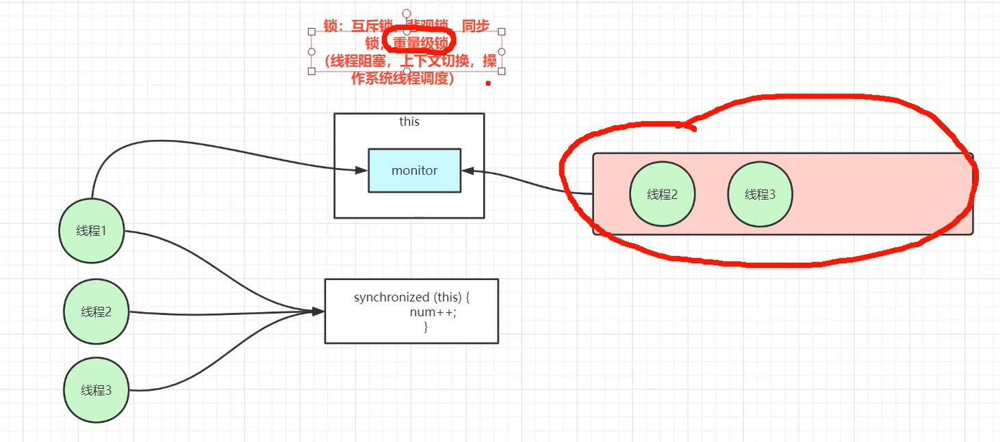
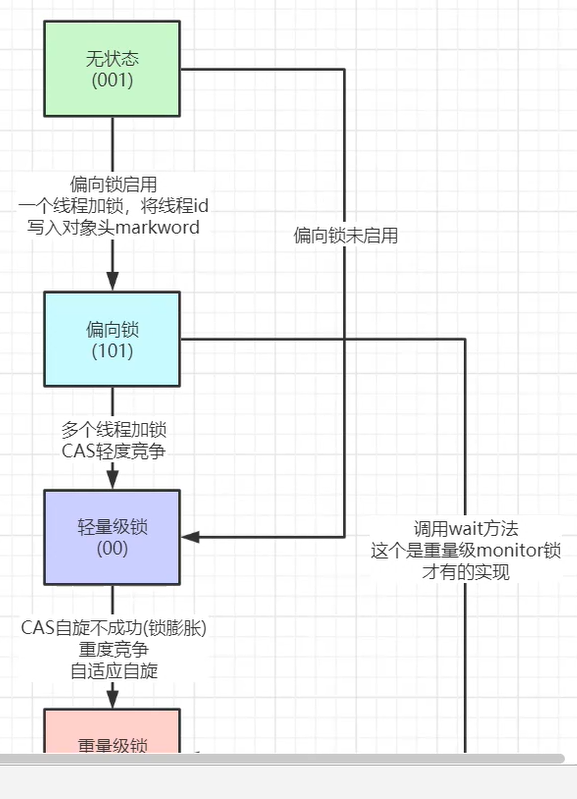

# 锁
视频：https://www.bilibili.com/video/BV1awyAYLExF 
## 互斥锁，悲观锁，重量级锁，同步锁
有线程阻塞、上下文切换、操作系统线程调度等问题


调用 increase() 方法时候把 对象 上锁
```java
public class A {
    private int a = 0;
    public synchronized void increase(){
        this.a++;
    }
    public int getA(){
        return this.a;
    }
}
```
调用 increase() 方法时候把 类 上锁
```java
public class A {
    private static int a = 0;
    public synchronized void increase() {
        A.a++;
    }
    public static int getA() {
        return A.a;
    }
}
```

## 无锁、自旋锁、乐观锁、轻量级的锁 
CAS机制 **compareAndSet()**
```java
// 轻量级的锁
private final AtomicInteger aLight = new AtomicInteger(100);
public void increaseLight() {
    aLight.incrementAndGet();
}
public int getALight() {
    return aLight.get();
}
```
```java
// 轻量级的锁
private final AtomicInteger atomicInteger = new AtomicInteger(0);
public void increaseAtomicInteger() {
    atomicInteger.incrementAndGet();
    // 上面的代码 类似于 下面的代码
//        while(true){
//            int oldValue = atomicInteger.get();
//            int newValue = oldValue + 1;
//            if(atomicInteger.compareAndSet(oldValue, newValue)){    // CAS
//                break;
//            }
//        }
}
public int getAtomicInteger() {
    return atomicInteger.get();
    }
```
## 特性
- 原子性：lock cmpxchgq
lock 检查CPU是否多核心，返回1 对缓存行 或者 大于 64字节 缓存总线 加锁 
cmpxchagq 比较并且交换
- **ABA 问题**：有第三方线程对 当前线程要操作的变量从 A->B->A 表面上 当前线程的操作没有问题\
但是 实际上其他线程已经对数据进行了修改 但是又立刻改回来罢了 \
如何解决ABA问题：可以再加一个变量 version (A, 0)->(B, 1)->(A, 2) 发现值虽然一样 
但是版本已经从 0 变 3 了


## 对锁进行优化 -> 锁的状态
