# 插入数据优化
## 少量数据插入-使用insert
- 批量操作(500-1000条)
- 手动提交事务
- 主键顺序插入
## 大量数据插入-使用load
load的使用方法
```mysql
# 连接数据库时，加上参数 --local-infile
mysql --local-infile -u root -p
# 是个直全局参数local_infile为1，开启从本地加载文件导入数据的开关
set global local_infile = 1;
# 执行load指令将准备好的数据，加载到表结构中
load data local infile '/root/sql.log' into table 'user' fields terminated by ',' lines terminated by '\n';
```


# 主键优化
## 页分裂
插入数据后，可能会导致页分裂


## 页合并
删除数据后，可能会导致页合并 \
阈值默认 50%
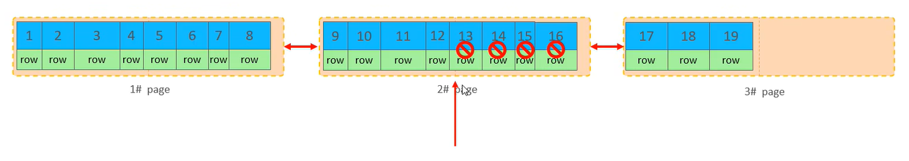
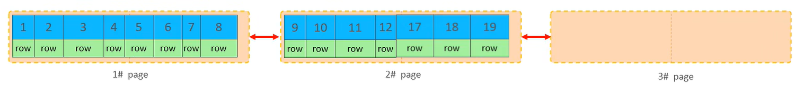
# order by

## 主键的设计原则
- 主键长度尽可能要小 \
因为聚集索引只有一个（默认是主键索引），而二级索引有很多，聚集索引的叶子节点存储的是聚集索引的值，所以如果聚集索引的长度较大，则会浪费很多空间
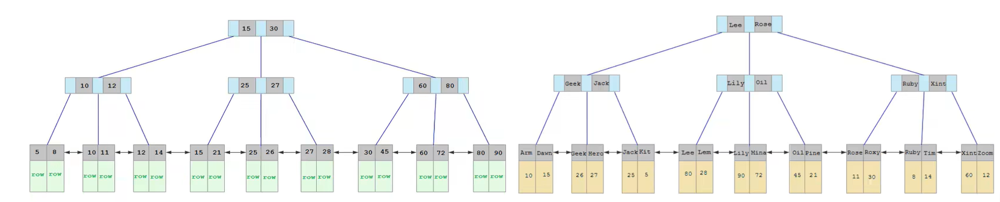
- 插入数据时，尽量选择顺序插入
- 尽量不要使用UUID做主键或者是其他的自然主键，例如身份证号码
- 业务操作的时候，避免对主键的修改


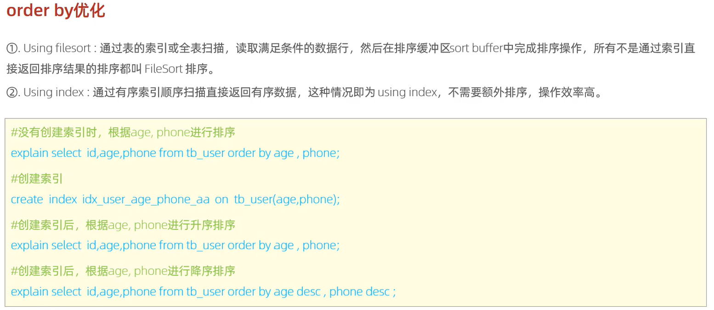
- 尽可能使用索引进行 order by操作
- order by 索引 不用重新排序
- order by 非索引 需要重新排序 耗时
```mysql
# 表中存在 id 的聚合索引 和 name_age 的 联合索引
# 下面的 SQL 语句 不使用了索引 而是 filesort
explain select * from student order by age;
explain select age, name from student order by id;

show index from student;

# 表中存在 id 的聚合索引 和 name_age 的 联合索引
# 下面的 SQL 语句 使用了索引 而不是 filesort
explain select name, age from student order by name;
explain select id, name, age from student order by name;
explain select id, name, age from student order by name;
# 使用了 索引 + 反向索引
explain select id, name, age from student order by name desc;
explain select id, name, age from student order by name asc, age desc;
# 两种都使用了
explain select id, name, age from student order by age, name;
```
- 创建自定义排序的索引
```mysql
# 创建自定义排序的索引
create index idx_name_age_ad on student (name asc, age desc );
# 则下面的 SQL 语句不再使用 filesort + index 而是 只使用 index
explain select id, name, age from student order by name asc, age desc;

show index from student;
```
查看新的索引
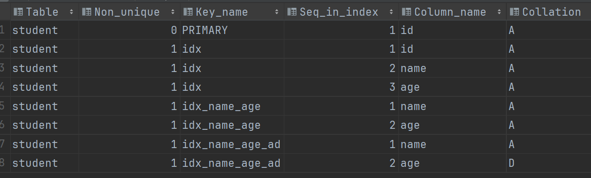

- 前面所有的语句成立的条件是 覆盖索引 没有 select 不存在没有被索引覆盖的字段
```mysql
# using index
explain select id, name, age from student order by name;
# using filesort
explain select id, name, age, sex from student order by name;
```
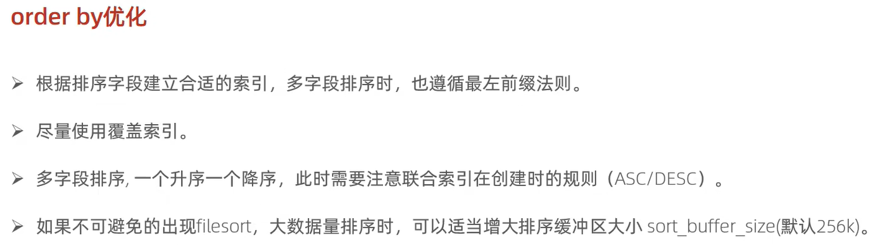


# group by 优化
```mysql
# 新增部门字段
alter table student add department varchar(20);
# 更改字段的值
update student set department = 'cs' WHERE id = '1024040901';
update student set department = 'cs' WHERE id like '102404____';

select * from student;
# 插入通信学院的学生
insert into student values ('ZhangSan', 24, '1024010101', '北京', '男', '2024-09-10', 'tel');
insert into student values ('ZhangWuge', 24, '1024010103', '南京', '男', '2024-09-10', 'tel');
insert into student values ('LiuXiao', 28, '1022010104', '苏州', '男', '2020-09-10', 'tel');
insert into student values ('FengCuo', 24, '1024010105', '杭州', '女', '2024-09-10', 'tel');
insert into student values ('MaJia', 24, '1024010106', '杭州', '男', '2024-09-10', 'tel');
insert into student values ('LiSu', 24, '1024010508', '南京', '女', '2024-09-10', 'tel');

# 插入电子学院的学生
insert into student values ('Zhang', 26, '1022020101', '北京', '男', '2022-09-10', 'electronics');
insert into student values ('MaXi', 24, '1024020102', '苏州', '男', '2024-09-10', 'electronics');
insert into student values ('JiLi', 26, '1022020102', '上海', '女', '2022-09-10', 'electronics');
insert into student values ('LiXinGui', 24, '1024020105', '南京', '男', '2024-09-10', 'electronics');
insert into student values ('WangXiaoxi', 24, '1024020120', '南京', '女', '2024-09-10', 'electronics');
insert into student values ('XingPao', 24, '1024021028', '杭州', '男', '2024-09-10', 'electronics');


electronic

```
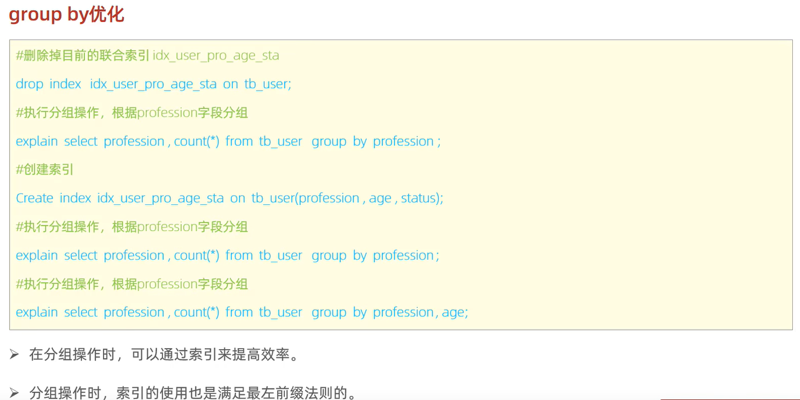

# limit 分页查询的优化
```mysql
# 从第 1000000 条数据的位置 向后面检索 10 条数据 返回   非常耗时
select * from student limit 1000000, 10;
```
- 解决方法 \
覆盖索引 + 子查询
```mysql
# 先查询 id
select id from student order by id limit 1000000, 10;

# 将上面SQL的返回结果看成一张表
select s.* from student s, (select id from student order by id limit 10000000, 10) a where s.id = a.id;
```
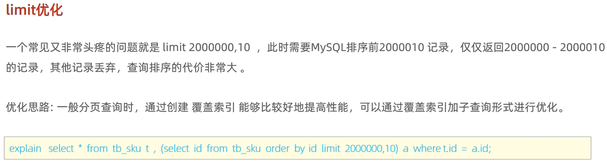
# count 聚合函数的优化
- 使用内存数据库进行计数 Redis
- 推荐使用 count(*) 和 count(1) 因为不需要取数据
```mysql
# 查询 2024级 通信学院的+学硕数量
select count(*) from student where department = 'tel' and id like '__24______';
select * from student where department = 'tel' and id like '__24______';
update student set sex = null where id = '1024040901';

# count 的几种操作
select count(*) from student;
select count(id) from student;
select count(name) from student;
# count(*) 不统计 null 值
select count(sex) from student;
select count(age) from student;
select count(department) from student;

# count() 里面的数字随便
select count(1) from student;
select count(0) from student;
select count(-1) from student;
```
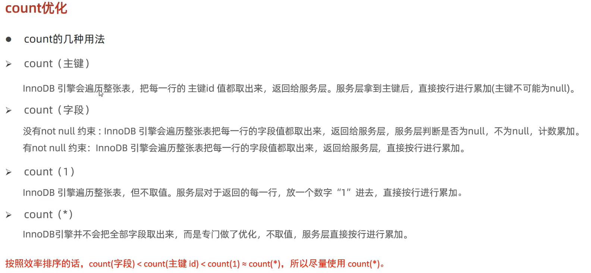
# update 优化
- 即where 后面必须跟 索引，因为使用索引进行筛选只会产生行锁，而where 不根据索引进行更新，则会升级为表锁，整张表在 commit之前，均不可使用。
- 有索引就是行锁 没有索引就是表锁
```mysql
begin;
update student set name = 'YanYan' where id = '1024040908';
commit;
select * from student where id = '1024040908';
```

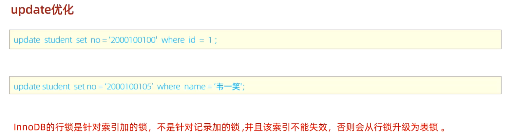

# 总结
- 基本上都是对索引进行优化
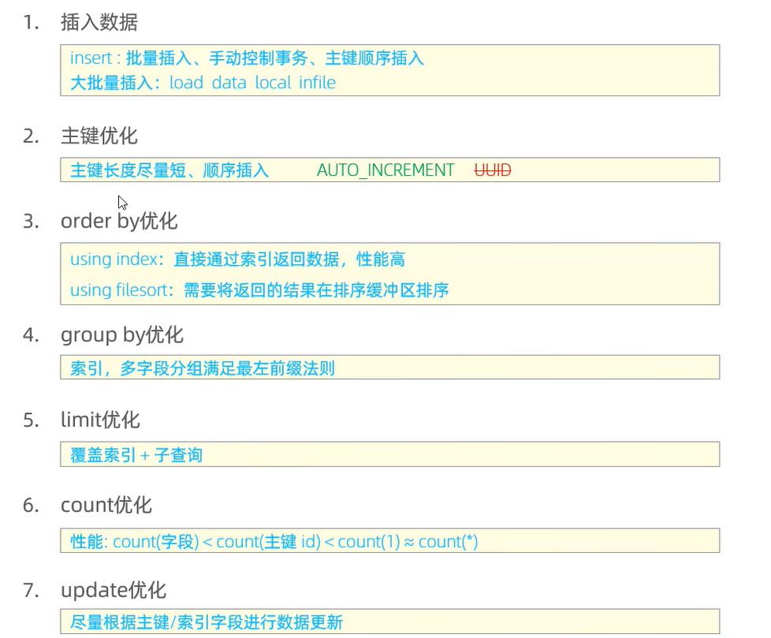


