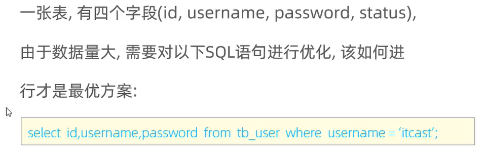

# MySQL
视频：https://www.bilibili.com/video/BV1Kr4y1i7ru
## 体系结构


```sql
use nnsql;

show create table account;

CREATE TABLE `account` (
                           `name` varchar(10) DEFAULT NULL,
                           `money` int DEFAULT NULL
) ENGINE=InnoDB DEFAULT CHARSET=utf8mb4 COLLATE=utf8mb4_0900_ai_ci
```

## InnoDB存储引擎
### 特点
- 支持事务
- DML遵循ACD模型
ACID：原子性 隔离性 一致性 持久性
- 支持行级锁 提高并发访问性能
- 支持外键 Foreign key 约束 保证数据的完整性和正确性

### 文件
InnoDB的每张表都会对应一个 XXX.ibd 的文件。该文件存储表的结构、数据和索引。
### 逻辑存储结构
表空间->segment段->extent区(1MB)->page页(16KB)->行row(存储数据表的一行数据)


### 存储引擎的选择


### 总结


## 索引
### 索引概述
索引在mysql的第三层 -> 引擎层 实现 \


### 索引的优缺点
**优点**
提高检索的效率，降低数据库的IO成本


### 索引的结构
InnoDB只支持B+树索引 \
B+树、哈希索引、R树索引、全表索引


**标准的B+树**


**MySQL中的B+树**\
双向循环链表

每个节点都存储在 页(16KB) 中

### Hash索引


### 思考题


### 索引的分类
- 主键索引：只能有一个，且默认自动创建
- 唯一索引：有多个 在创建字段时如果声明了 UNIQUE 关键字，则会自动创建唯一索引
- 常规索引：有多个
- 全文索引：有多个

### 聚集索引和二级索引


聚集索引下面挂着的数据是这一行的数据\
二级索引下面挂着的数据是这一行的数据的 id 值


```sql
select * from user where name = 'Tom';
```
**称为 回表查询**
先通过 name 字段的 二级索引进行 B+树查找， 查找到 name = 'Tom' 数据的 主键 id 值 \
在通过拿到的主键 id 值 回表查询 通过聚集索引再次查找所需的整行的数据。


### 思考题
- 问题1

一个是一次聚集索引，一个是两次索引查询
- 问题2


### 索引的语法
```sql
# 创建索引
create [unique|fulltext] index 索引名 on 表名 (字段1, 字段2, ...);

# 查看索引
show index from user;
  
# 删除索引
drop index 索引名 on 表名
```


### 完成需求

```mysql
# name字段为姓名字段，该字段的值可能会重复，为该字段创建索引。
create index 姓名 on user(name);
# phone手机号字段的值，是非空，且唯一的，为该字段创建唯一索引。
create unique index 手机号 on user(name);
# 为profession、age、status创建联合索引。
create index 联合索引 on user(id, name, gender);
```


### SQL性能分析
```mysql
# 查看增删改查的频率
show global status like 'Com_______';
```


### 慢查询日志
```mysql
explain select * from user;
```
### 索引的使用

#### 最左前缀原则
```mysql
# 在 user 表上建立 联合索引 (id, name, gender)
create index idx3 on user (id, name, gender);

# 符合最左前缀原则 会使用索引 idx3
select * from user where id = 100004 and name = 'Tom' and gender='男';

# 符合最左前缀原则 会使用索引 idx3索引字段出现顺序不重要
select * from user where name = 'Tom' and gender='男' and id = 100004;

# 符合最左前缀原则 会使用索引 idx3
select * from user where id = 100003 and name = 'Tom';

# 符合最左前缀原则 会使用索引 idx3
select * from user where id = 100001;

# 缺失最左端的索引字段 不会使用索引
select * from user where name = 'Tom' and gender='男';

# 有最左边的索引字段 所以会使用索引 部分索引 
# 只会使用 id 字段的索引 而不会使用 gender 字段的索引 因为中间缺失了 一个字段
# 即如果跳过某一列 则后面的列会失效
select * from user where id = 100008 and gender='男';
```

### 索引失效的几种情况
- 不要在索引列上进行运算操作，否则索引将会消失
```mysql
# mysql 对于 字符串类型的字段 index 从 1 开始计数
select * from student where substring(name, 3, 2) = 'ck';
explain select * from student where substring(name, 3, 2) = 'ck';
```
- 字符串类型的索引一定要加单引号，不加单引号虽然也能查询出来，但是不会走索引，效率低下
```mysql
# 全表扫描
explain select * from student where id = 1024040908;

# 索引查询
explain select * from student where id = '1024040908';
```

- 模糊查询
尾部模糊匹配，索引不失效；头部模糊匹配，索引失效
```mysql
# 全表扫描 头部模糊匹配
select * from student where id like '%0908';
explain select * from student where id like '%0908';

# 索引查询 尾部模糊匹配
select * from student where id like '102404090%';
explain select * from student where id = '102404090%';
```
- or 连接的索引 只有前后都有索引 才会走索引；只要前后一个地方没有索引，则全部索引失效
```mysql
# 下面两条都不走索引 因为 address 字段不是索引
select * from student where id = '1024040908' or address = '南京';
explain select * from student where id = '1024040908' or address = '南京';
explain select * from student where address = '南京' or id = '1024040908';
# 前后都是索引 name 是 单列索引 id 遵循 联合索引的最左原则
explain select * from student where name = 'Jack' or id = '1024040908';
```


- 索引查询比全表查询还要慢 则mysql会自动使用全表查询 放弃索引查询
```mysql
# 不使用 索引
explain select * from student where id > '1024040900';
# 使用 索引 查询
explain select * from student where id > '1024040905';
```
- is null 和 is not null
那个少 那个使用索引
```mysql
# null 少
# 使用索引
explain select * from student where id is null;
# 不使用索引
explain select * from student where id is not null;
# not null 少
# 使用索引
explain select * from student where id is not null;
# 不使用索引
explain select * from student where id is null;
create index idx_name_age on student (name, age);
```
### 索引提示 手动选择要使用的索引
```mysql
# 可能使用 name的单列索引 也可能使用 (name, age) 联合索引
explain select * from student where name = 'Jack';

# 指定索引 将 联合索引 (name, age) 改为 单列索引 name
explain select * from student use index (idx_name_age) where name = 'Jack';
explain select * from student use index (idx_name) where name = 'Jack';

# 忽略指定的索引
explain select * from student ignore index (idx_name) where name = 'Jack';

# 上面的 use 和 ignore 指令 只是 建议 mysql 使用指定的索引  并不会一定执行我们指定的索引
# 可以使用 force 指令 强制指定 索引
explain select * from student force index (idx_name) where name = 'Jack';
```


### 覆盖索引
```mysql
# 如果 select 的 东西 被 索引 覆盖到了 则 不用回表查询
# extra 信息 若出现 using index condtion 则 -> 使用了索引 但是需要回表查询
# 使用 索引 idx = (id, name, age)
explain select id from student where id = '1024040908';
# 使用 索引 idx = (id, name, age)
explain select id, name from student where id = '1024040908';
# 使用 索引 idx = (id, name, age)
explain select id, name, age, entrance from student where id = '1024040908';
# 使用 索引 idx = (id, name, age)
explain select name from student where id = '1024040908';
# 使用 索引 idx = (name, age)
explain select id, name, age from student where name = 'Jack';
show index from student;


# 如果 select 的 东西 没有被 索引 覆盖 则必须再次回表查询
explain select entrance from student where id = '1024040908';

```
**注意：下面的SQL语句不需要回表查询; 因为通过联合索引 (name, age) 来检索，且叶子节点存储的数据是主键id 即一次二次索引检索就可获取到了所需要
的三个字段   id name age**
```mysql
select id, name, age from student where name = 'Jack'
```

- 索引覆盖 \

- 索引未覆盖\

### 概念
- 聚集索引 = 主键索引
- 二级索引 = 辅助索引 

**如果使用二级索引，则B+树叶子结点存储的是主键索引，如果select选择的字段没有全部被该 二级索引所覆盖，则会根据查到的聚集索引的值，进行回表查询
查找所有的字段，然后返回所需要的字段**

**若select的所有字段都被 二级索引 所覆盖， 则不用执行回表查询，直接返回即可**
下图展示了没有覆盖索引，使用回表查询


#### 覆盖是索引思考题
该怎么建立索引

```mysql
create index idx_studetn_name_pass on student (name, pass);
```

### 前缀索引
- 目的：为字符串字段建立索引的要考虑，因为如果字段非常大，则会导致索引很大，导致大量磁盘IO的问题，查询效率降低，
解决方法，选取字符串前 n 个字符作为 前缀，使用前缀建立索引。
```mysql
# 先计算所有字符串字段的选择率 判断使用那个字段
select count(distinct 字段名) / count(*) from 表名;
# 再计算该字段的选择率 确定使用前缀的长度
select count(distinct substring(字段名, 起点, 长度)) / count(*) from 表名;

# 建立前缀索引
create index 索引名 on 表名(字段名(取几个字符作为前缀n)) 
```

### 单列索引和联合索引
推荐使用联合索引，避免使用单列索引

### 索引设计原则


### 索引总结


## SQL优化

## 视图

## 锁

## InnoDB引擎


