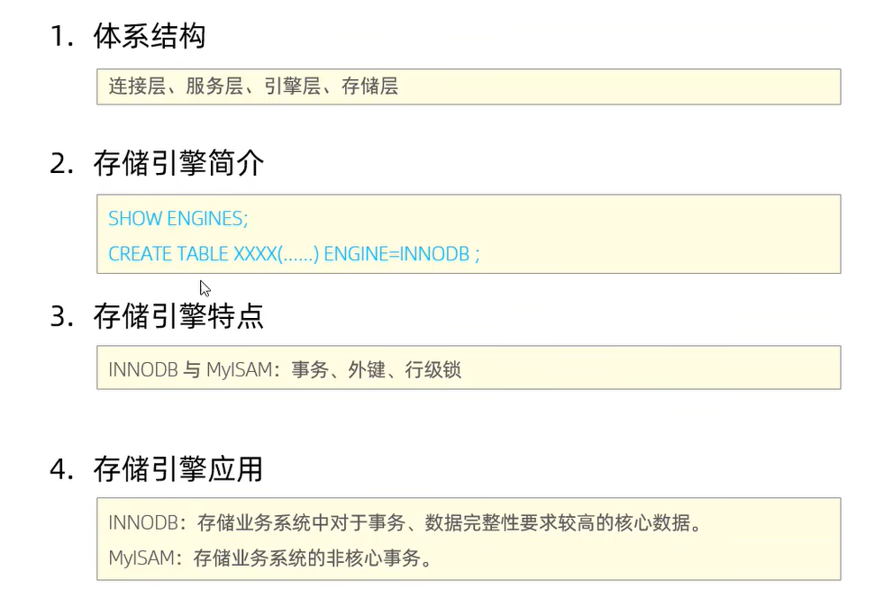
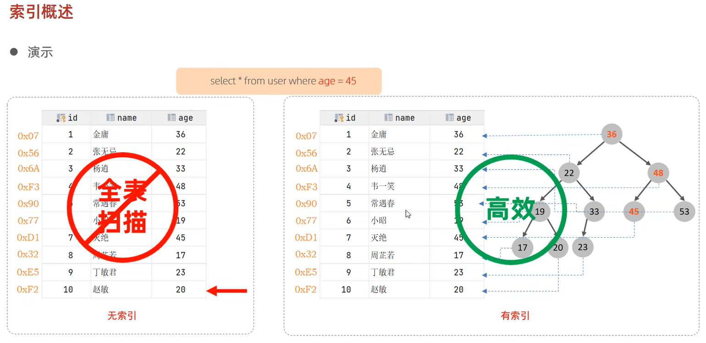
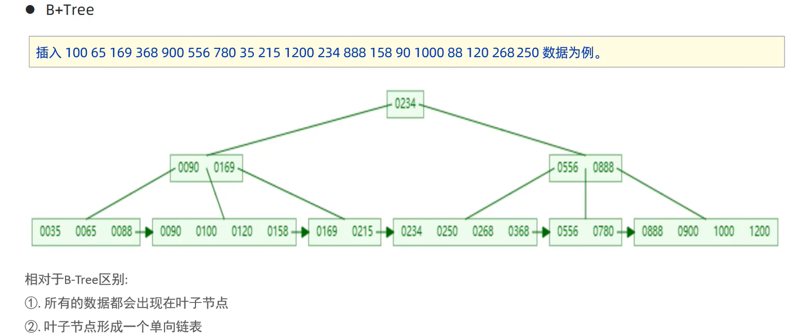
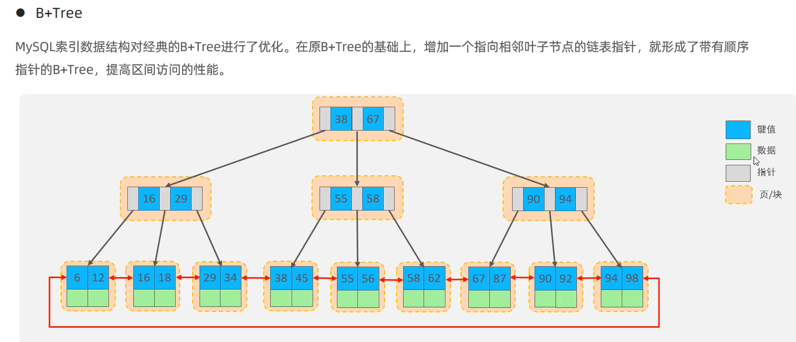
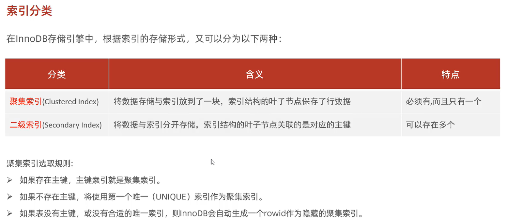
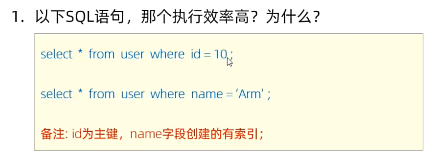
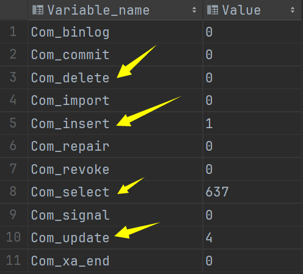

# MySQL
## 体系结构


```sql
use nnsql;

show create table account;

CREATE TABLE `account` (
                           `name` varchar(10) DEFAULT NULL,
                           `money` int DEFAULT NULL
) ENGINE=InnoDB DEFAULT CHARSET=utf8mb4 COLLATE=utf8mb4_0900_ai_ci
```

## InnoDB存储引擎
### 特点
- 支持事务
- DML遵循ACD模型
ACID：原子性 隔离性 一致性 持久性
- 支持行级锁 提高并发访问性能
- 支持外键 Foreign key 约束 保证数据的完整性和正确性

### 文件
InnoDB的每张表都会对应一个 XXX.ibd 的文件。该文件存储表的结构、数据和索引。
### 逻辑存储结构
表空间->segment段->extent区(1MB)->page页(16KB)->行row(存储数据表的一行数据)


### 存储引擎的选择


### 总结


## 索引
### 索引概述
索引在mysql的第三层 -> 引擎层 实现 \



### 索引的优缺点
**优点**
提高检索的效率，降低数据库的IO成本


### 索引的结构
InnoDB只支持B+树索引 \
B+树、哈希索引、R树索引、全表索引


**标准的B+树**


**MySQL中的B+树**\
双向循环链表

每个节点都存储在 页(16KB) 中

### Hash索引


### 思考题


### 索引的分类
- 主键索引：只能有一个，且默认自动创建
- 唯一索引：有多个 在创建字段时如果声明了 UNIQUE 关键字，则会自动创建唯一索引
- 常规索引：有多个
- 全文索引：有多个

### 聚集索引和二级索引


聚集索引下面挂着的数据是这一行的数据\
二级索引下面挂着的数据是这一行的数据的 id 值


```sql
select * from user where name = 'Tom';
```
**称为 回表查询**
先通过 name 字段的 二级索引进行 B+树查找， 查找到 name = 'Tom' 数据的 主键 id 值 \
在通过拿到的主键 id 值 回表查询 通过聚集索引再次查找所需的整行的数据。


### 思考题
- 问题1

一个是一次聚集索引，一个是两次索引查询
- 问题2


### 索引的语法
```sql
# 创建索引
create [unique|fulltext] index 索引名 on 表名 (字段1, 字段2, ...);

# 查看索引
show index from user;
  
# 删除索引
drop index 索引名 on 表名
```


### 完成需求

```mysql
# name字段为姓名字段，该字段的值可能会重复，为该字段创建索引。
create index 姓名 on user(name);
# phone手机号字段的值，是非空，且唯一的，为该字段创建唯一索引。
create unique index 手机号 on user(name);
# 为profession、age、status创建联合索引。
create index 联合索引 on user(id, name, gender);

```


### SQL性能分析
```mysql
# 查看增删改查的频率
show global status like 'Com_______';
```


### 慢查询日志


## SQL优化

## 视图

## 锁

## InnoDB引擎


