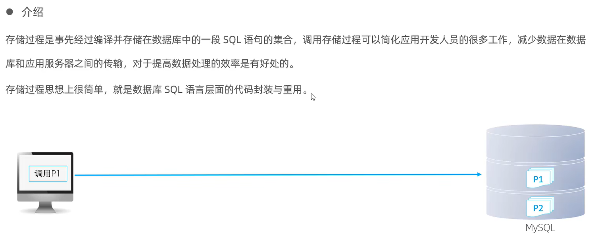
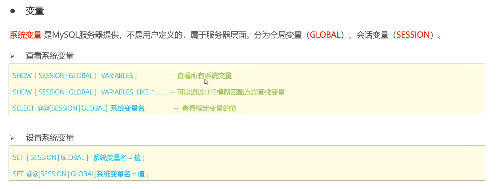
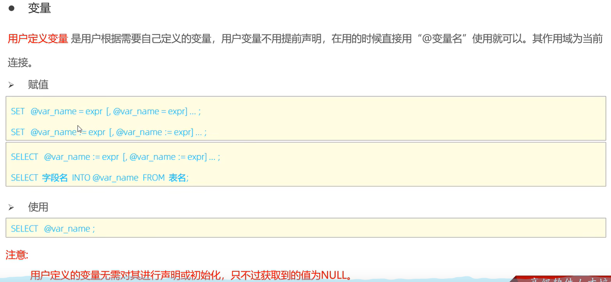

# 介绍

特点
- 封装 复用
- 可以接受参数 可以返回数据
- 减少网络交互 提升效率

# 基本语法
```mysql
创建存储过程
create procedure 存储过程名([参数列表])
begin
    --SQL语句
end;
# 调用 
call 存储过程名(参数)
```
创建实例
```mysql
# 创建
create procedure p1()
begin 
    select count(*) from student;
end;

# 调用
call p1();

# 查看
# 方式一
select * from information_schema.ROUTINES where ROUTINE_SCHEMA = 'student';
# 方式二
show create procedure p1;
#  删除
drop procedure if exists p1;

# 如果在命令行中进行操作 由于有多个分号
delimiter $$
create procedure p1()
begin
    select count(*) from student;
end;
# 再改回来
delimiter ;
```
# 变量-系统变量
- 分为全局系统变量和会话系统变量

## 查看
```mysql
# 查看所有的系统变量
show variables ;
show session variables like 'auto%';
show global variables  like 'auto%';

```
## 设置
```mysql
set session autocommit = 0;
#####
commit;
```
# 变量-用户定义变量
不用声明

作用域仅为当前会话
```mysql
# 赋值
set @myname := 'Hello';
select count(*) into @mycount from student;
# 使用
select @myname;
select @mycount;
```
# 变量-局部变量
局部变量必须舒使用 declare 关键字进行声明
作用域为 begin 和 end 之间
```mysql
create procedure p2()
begin 
    # 先声明
    declare scount int default 0;
    # 再赋值
    select count(*) into scount from student;
    # 再使用
    select scount;
end;

call p2();
```


# if 条件判断
跳过了 感觉没什么用


