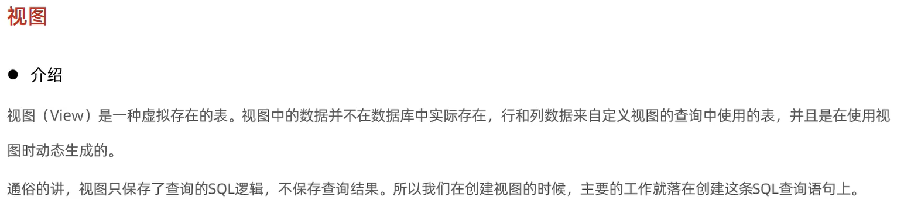
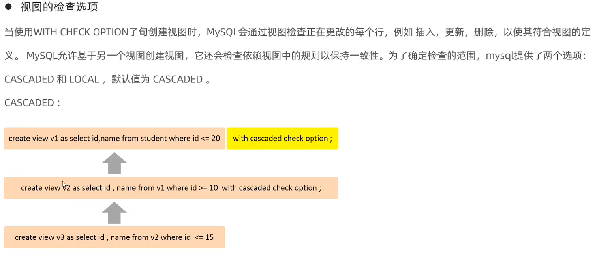
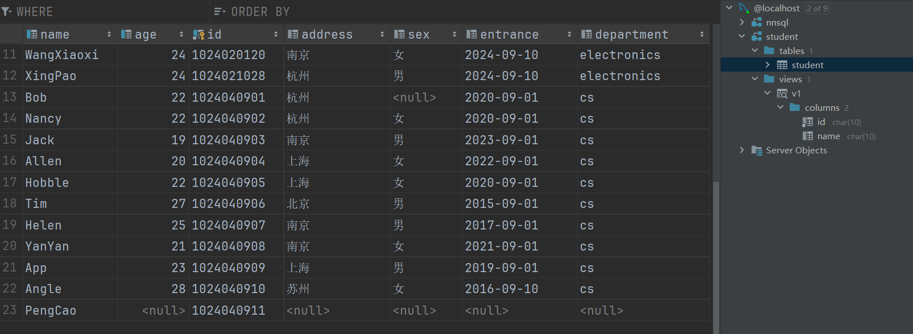
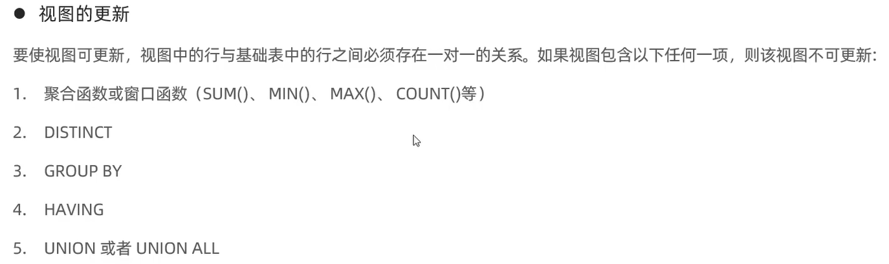
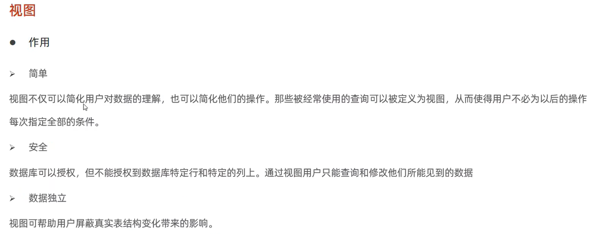

# 定义
视图 view 一张虚拟存在的表


# 增删改查视图
```mysql
# 创建视图
create or replace view v1 as select id, name from student where id < '1024040908';

# 查询创建视图的语句
show create view v1;
# 查询视图 与 查询表一样
select * from v1;
select * from v1 where id < '1024010105';

# 修改视图 两种方法
create or replace view v1 as select id, name from student where id < '1024040908';
alter view v1 as select id, name from student where id like '102404091_';


# 删除视图
drop view if exists 视图的名字;
```

# 对视图执行类似表的增删改查
```mysql
insert into v1 values ('1024040912', 'PengCao');

```
- with cascaded check option 选项 级联
```mysql
create or replace view v1 as select id, name from student where id < '1024040908' with cascaded check option ;
# 下面的SQL 语句可以执行
insert into v1 values ('1024040915', 'KeLa');

create or replace view v1 as select id, name from student where id < '1024040908' with cascaded check option ;
# 下面的SQL 语句禁止执行
insert into v1 values ('1024040915', 'KeLa');
```

- with local check option 选项 级联

插入的数据在视图和表里都存在


# 视图更新的条件
视图和表的每一行要一一对应


# 视图的作用
- 简单
- 安全
- 数据独立



# 一个案例
```mysql
# 为了安全性 隐去一些字段
create view v2 as select id, name, age from student;
# 简化多表查询 每次使用创建的视图就好了 不用每次写多表查询
select s.name, s.id, c.name from student s, student_course sc, course c 
         where s.id = sc.studentid and sc.courseid = c.id order by s.id;
# create view as 加上上面的 SQL 语句
create view vsc as select s.name sname, s.id sid, c.name cname from student s, student_course sc, course c
    where s.id = sc.studentid and sc.courseid = c.id order by s.id;

update student set name = 'YanFanyu' where id = '1024040908';

select * from vsc;

```


