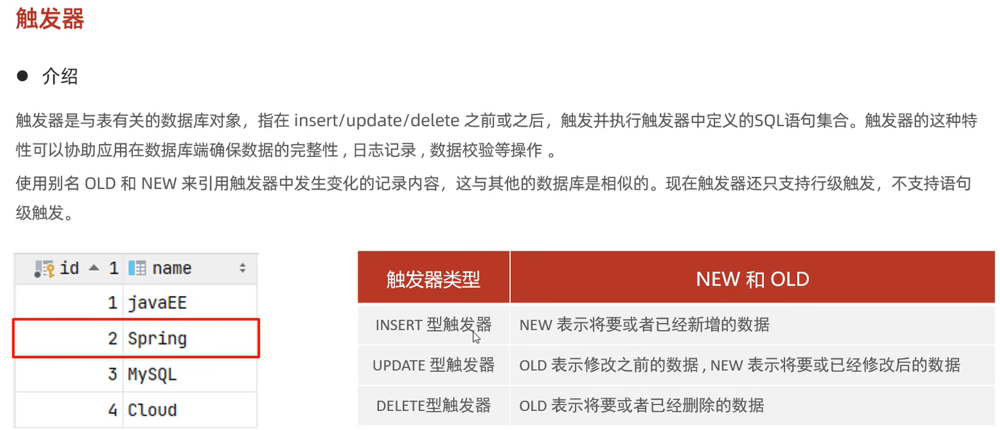

# 介绍


# 语法
```mysql
# 创建实例
# 需求分析：通过触发器记录 student 表的数据变更日志(student_logs) 包含增加，修改，删除
# 准备工作：创建 student_logs 表
create table student_logs(
    id int(11) not null auto_increment,
    operation varchar(20) not null comment '操作类型, insert/update/delete',
    operate_time datetime not null comment '操作时间',
    operate_id int(11) not null comment '操作的ID',
    operate_params varchar(500) comment '操作参数',
    primary key (id)
)engine=innodb default charset =utf8;

# 插入数据的触发器
create trigger tstudent
    after insert on student for each row 
begin 
    insert into student_logs(id, operation, operate_time, operate_id, operate_params) 
        values (null, 'insert', now(), new.id, 
                concat('插入的数据为：id=', new.id, ', name=', new.name, ', age=', new.age));
end;
# 修改数据的触发器

insert into student (id, name, age) value ('1024040124', 'SiLiu', 24);
insert into student (id, name, age) value ('1024040125', 'LiuNeng', 24);
# 删除数据的触发器
show triggers tstudent;

# 查看
show triggers ;
# 删除
drop trigger student.tstudent;

```

# 实例
