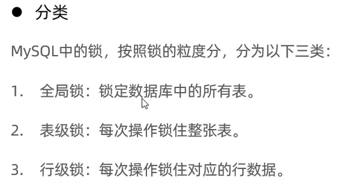
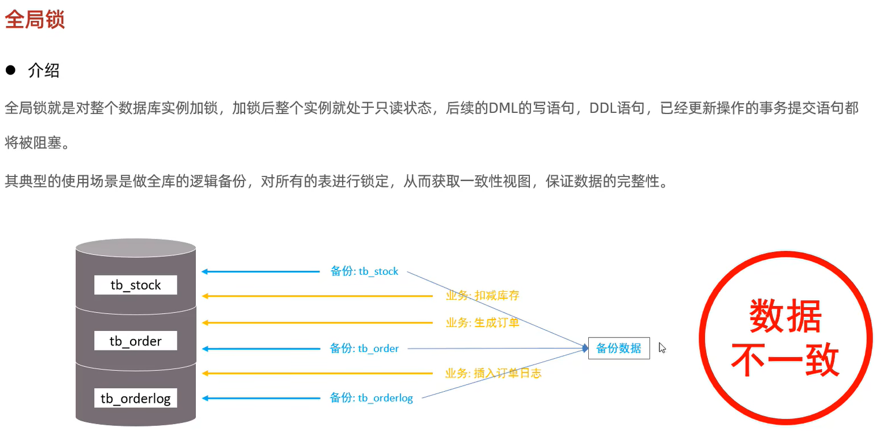
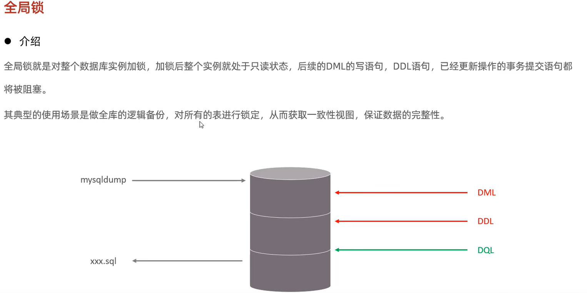
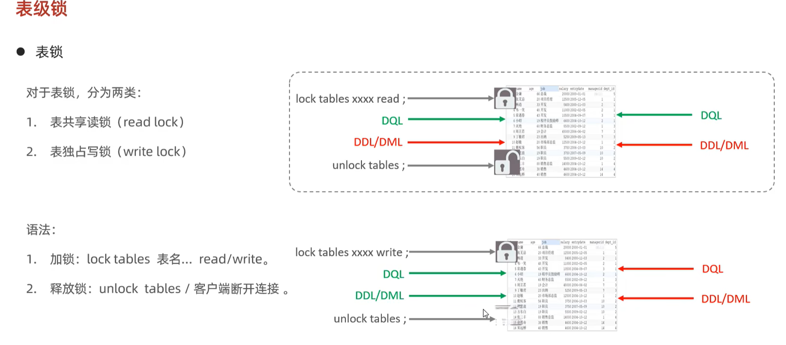

# 锁的概述
- 介绍

- 分类


# 全局锁
- 数据不一致
已经备份了库存表，但是订单表修改了，导致数据不一致

- 介绍

- 加全局锁与释放全局锁
```mysql
# 1 加锁 -> 只能读不能写
flush table with read lock;
# 2 备份
# todo 注意 此条语句 不是 SQL 语句 应该在 windows命令行执行
mysqldump -uroot -proot student > student.sql;
# 3 解锁
unlock tables;

```
- 特点
导致其他操作不能进行，性能降低
- 解决办法 添加 --single-transaction 参数 让mysql不开启全局锁
```mysql
mysqldump --single-transaction -uroot -proot student > student02.sql;
```


# 表级锁
- 表锁
```mysql
create table score(
  id int primary key ,
  name varchar(10),
  math int,
  english int,
  chinese int
);

insert into score values (1, 'Tom', 67, 88, 95);
insert into score values (2, 'Rose', 23, 66, 90);
insert into score values (3, 'Jack', 56, 98, 76);
select * from score;
# 加锁
lock tables score read ;
# 所有客户端均可执行通过
select * from score;
# 当前客户端执行会报错
# 其他客户端执行会等待阻塞
update score set math = 100 where id = 2;
# 解锁
unlock tables ;

```

-[ ] 表共享锁(读锁) \
本客户端: 可读不可写 \
其他客户端: 可读不可写 \
-[ ] 表独占锁(写锁) \
本客户端: 可读可写 \
其他客户端: 不可读不可写
- 元数据锁(meta data lock, MDL)
- 意向锁


# 行级锁


